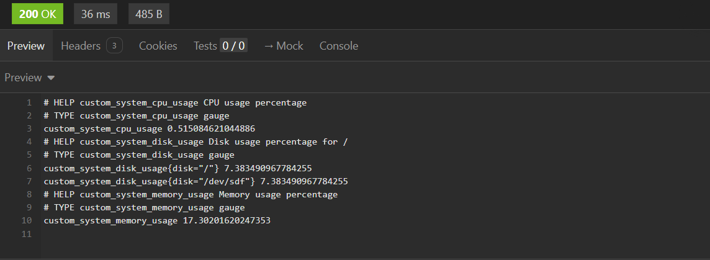
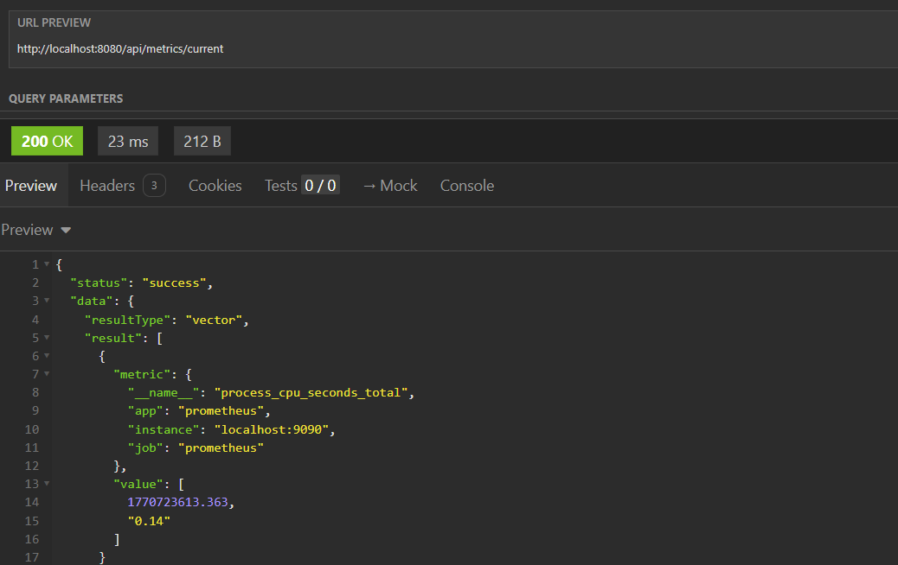
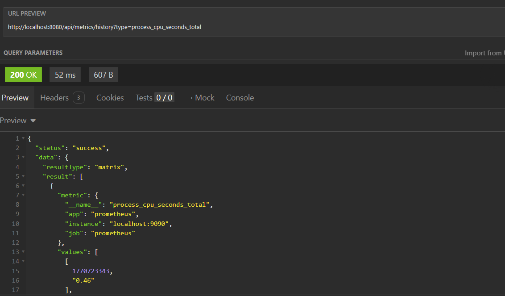

# Monitor Service

Kotlin + Spring Boot service for exposing and querying system metrics, ready to run with Docker / Docker Compose and integrated with Prometheus.

## Overview
- Exposes host metrics (CPU, memory, disks, and service metrics) in Prometheus-compatible format at `/api/metrics/prometheus`.
- Queries Prometheus to provide REST endpoints:
    - `GET /api/metrics/current` — current metrics (instant query).
    - `GET /api/metrics/history` — historical metrics (range query).
- Modular project using WebClient for Prometheus communication, Micrometer for metrics exposure, and configuration for running via Docker Compose.

## Key Technologies
- Kotlin (JDK 17)
- Spring Boot (Web + WebFlux)
- Micrometer Prometheus
- WebClient (Spring WebFlux)
- Maven
- Docker
- Docker Compose

## How to Run

### Prerequisites

- Docker and Docker Compose installed.
- Local build before running docker-compose:

```bash
  mvn -DskipTests clean package
```

### Run with Docker Compose (recommended)

Build and start (rebuilds the image and recreates containers):
```bash
  docker-compose up --build --force-recreate
```

### Run locally

Build and start using local configuration:

```bash
  docker compose -f docker-compose.local.yml up --build --force-recreate
```

Activate the local profile in Spring with the following VM option:
```plaintext
  -Dspring.profiles.active=local
```

## Endpoints and Usage Examples

### 1. Prometheus Exposure

GET `/api/metrics/prometheus` — returns text in Prometheus scraping format.

```bash
curl http://localhost:8080/api/metrics/prometheus
```

Output:


### 2. Current Metrics (instant query)

GET `/api/metrics/current` — returns current metrics.

```bash
curl --request GET --url http://localhost:8080/api/metrics/current
```

Output:


### 3. Historical Metrics (range query)

GET `/api/metrics/history` — returns historical metrics.

```bash
curl --request GET --url http://localhost:8080/api/metrics/history
```

Output:


## Architecture Decisions

- Reactive WebClient for non-blocking calls to Prometheus.
- Environment-based configuration to simplify deployment across different environments (local/docker).